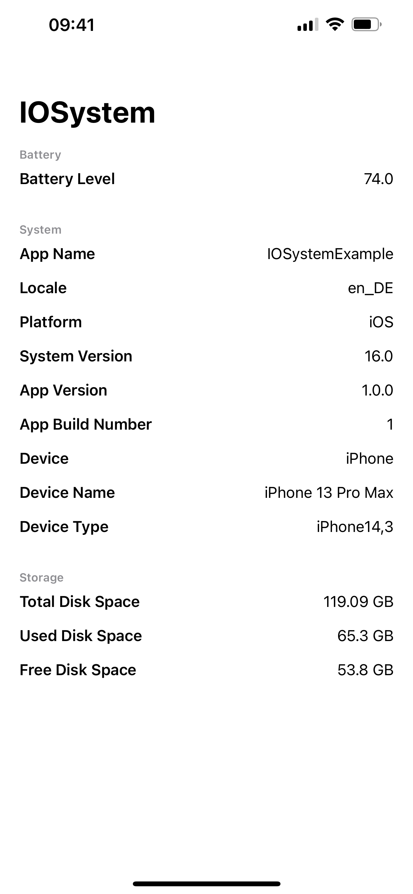

# IOSystem

A simplified manager to read system values for your iOS app.

---

### 💰 Support
I fell in love with coding in 2016 and there has been no looking back since! If you, or your company, use any of my projects or like what I'm doing, kindly consider supporting me.

I really appreciate you **[buying me a coffee ☕️](https://ko-fi.com/kaevin)**

---

### 👋 Let's Connect

- Follow me on **[👨‍💻 Github](https://github.com/kaevinio)** and stay updated on free and open-source software
- Follow me on **[🐦 Twitter](https://twitter.com/iamkaevin)** to get updates on my latest projects

---

## 📖 Content
- [Features](#features)
- [Screenshots](#screenshots)
- [Installation](#installation)
- [How to Use](#how-to-use)

## 🪄 Features

- [x] Current battery level (percentage)
- [x] Different values of your app and device
- [x] Device storage (in GB)

## 📱 Screenshots

## 🛠 Installation
##### Requirements
- iOS 14.0+ / macOS 11.0
- Xcode 13+
- Swift 5+

##### Swift Package Manager
In Xcode, go to `File > Add Packages` and add `https://github.com/kaevinio/IOSystem.git`. Add the package to all your targets.

## 📝 How to Use

To read system values, you need to `import IOSystem` at the top of your file. Depending on the values you want to read, there are three different Managers available: `BatteryManager`, `SystemManager` and `StorageManager`. Each manager contains values which can easily be read by calling `SystemManager.appName` or `StorageManager.totalDiskSpaceInGB`.

You can find a full list of available values below and in the example project.

**Important**: To read from `BatteryManager`, you need to call `BatteryManager()` with parenthesis, because it needs to be initialized before being able to read battery levels.

##### BatteryManager
- .batteryLevel

##### SystemManager
- .appName
- .platform
- .systemVersion
- .appVersion
- .buildNumber
- .appName
- .modelName
- .modelType
- .operatingSystem
- .locale

##### StorageManager
- .totalDiskSpaceInGB
- .usedDiskSpaceInGB
- .freeDiskSpaceInGB
